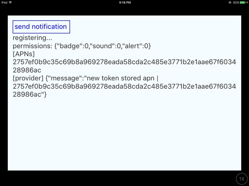

### Push Notification Server

Simple nodejs server using [express](http://expressjs.com/) webserver that can be used as provider for both GCM and APNs.


### Installation

Clone the repository and `cd` into the `server` folder and run `npm install`:

```
 $ git clone git@github.com:abudaan/push-notification-server.git
 $ cd push-notification-server/server
 $ npm install
```


Next we set up a database, in this database we store the device tokens of the registered devices. Assuming you have PostgreSQL server and psql client installed run:

```
 $ psql
```

You can use your default database:

```\connect {your_username}```


Alternately you can create a new database with SQL:

```CREATE DATABASE your_new_database```


Now create a table tokens by running the file `table.tokens.sql`:

```\i table.tokens.sql```


Before we can run the server we need to have a connection key and certificate to be able to connect to APNs, and a server key for connecting to GCM. We are going to setup the first test client, which is iOS only to get a connection key and certificate for APNs.

First ```cd``` to the 'client' folder then initialize react-native:

```
 $ cd ../client
 $ react-native init pushtest1
```

Now you get a warning "Directory pushtest1 already exists. Continue?", type "yes" and press enter.


During initialization you get several conflict warnings; always choose "n" for "do not overwrite"


Once the process has completed, we can open the file `./client/pushtest1/ios/pushtest1.xcodeproj` in Xcode. Unfortunately, you can not test push notifications in an emulator; you need to test on a physical iOS device, hence you need a paid developer account which will cost you $99 see [here](https://developer.apple.com/programs/how-it-works/).

After you are enrolled you can use your developer account to set up push notifications, follow the steps outlined [here](https://developer.apple.com/library/ios/documentation/IDEs/Conceptual/AppDistributionGuide/AddingCapabilities/AddingCapabilities.html#//apple_ref/doc/uid/TP40012582-CH26-SW6). In the last step the connection certificate and key are created. We need these to run our server, for now save them to your desktop or any other temporary location; we will get back to this later.

Let us first test the client. Connect your device, select this device as build target and build the project. Note that you need to have wifi enabled because in testing mode the javascript will be streamed to the app via a http connecting. If all goes well you will see something similar to this:



The app registers itself at the APNs and gets back a token that identifies the device and the app: the provider uses this token as an 'address' to send the notifications to. The line that starts with 'permissions' tells us that the app allows an incoming notification to set a bagde number, to play a sound and to display an alert.

The last line indicates is the result of an attempt of the app to connect to the provider, and since we haven't started our provider service yet, this yields a network error. So let's set up the server. First we need to convert the .p12 files that you've saved earlier to .pem files


